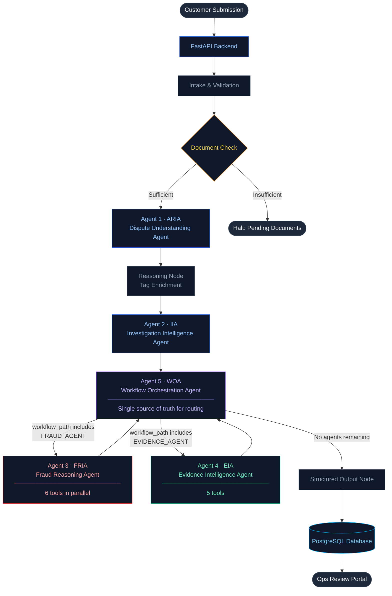

# AI Dispute Resolution System

Enterprise-grade, multi-agent platform for banking transaction dispute resolution. Built for BFSI operations teams — automates dispute intake, fraud detection, evidence verification, investigation planning, and case routing through a cooperative pipeline of 5 specialized AI agents.

---

## Architecture



**WOA is the single source of truth.** It decides which specialist agents run based on dispute category, fraud signals, and evidence gaps. Specialist agents only execute when WOA explicitly routes to them.

---

## Agents

### Agent 1 — ARIA (Dispute Understanding Agent)

Reads the dispute form, transaction metadata, and OCR-extracted document text. Produces the primary classification that all downstream agents build upon.

**Tools (pre-computed, deterministic):**
- `assess_transaction_context` — RBI liability tiers, off-hours risk, CNP channels
- `score_fraud_indicators` — OTP sharing, SIM swap, phishing, remote access, device loss
- `verify_evidence_match` — OCR document text vs claimed merchant and amount

**Outputs:** `dispute_category`, `fraud_suspicion`, `confidence_score`, `risk_tags`, `evidence_match`, `evaluated_files`, `evidence_trace`

**Evidence Provenance:** Agent 1 server-stamps every document it evaluates — filename, inferred document type, confidence score, and a verdict trace — so analysts know exactly which files the AI used.

---

### Agent 2 — IIA (Investigation Intelligence Agent)

Runs 4 database-backed tools against live customer, merchant, and case history before designing an investigation plan.

**Tools:**
- `lookup_customer_history` — dispute frequency, chargeback ratios, risk profile
- `check_merchant_risk` — category risk, complaint counts, blacklist status
- `find_duplicate_transaction` — identical merchant/amount/date within 72-hour window
- `lookup_related_cases` — outcomes of similar historical disputes

**Outputs:** `investigation_plan`, `required_documents`, `recommended_queue`, `investigation_complexity`, `recommended_steps`

---

### Agent 3 — FRIA (Fraud Reasoning Agent)

Only runs when WOA includes `FRAUD_AGENT` in the workflow path. Runs 6 tools in parallel via `ThreadPoolExecutor`. All numeric scores are server-side deterministic — the LLM synthesises narrative, not numbers.

**Tools (parallel execution):**
- `detect_transaction_anomalies` — off-hours flag, short-term velocity
- `evaluate_location_velocity` — geovelocity breach (impossible travel < 4 hours)
- `analyze_spending_behavior` — Z-score deviation from customer's spending baseline
- `verify_kyc_match` — CIF record comparison, name/contact alignment
- `evaluate_device_fingerprint` — device ID familiarity, location consistency
- `analyze_behavioral_patterns` — friendly fraud indicator from dispute history

**Outputs:** `fraud_probability`, `fraud_risk_level`, `user_trust_score`, `behavioral_risk_score`, `identity_verification`

**Server-side recalibration:** `fraud_probability` is always computed deterministically from tool flags — not from LLM output:
```
amount_anomaly    → +0.20
time_anomaly      → +0.15
velocity_anomaly  → +0.30
geovelocity_breach → +0.25
unrecognized_device → +0.30
location_mismatch → +0.20
```

---

### Agent 4 — EIA (Evidence Intelligence Agent)

Audits evidence completeness and transaction consistency. Separates customer-obtainable documents from bank-obtainable documents — only customer gaps affect completeness score and `investigation_blocked`.

**Tools:**
- `evaluate_evidence_completeness` — required docs vs fulfilled requests + upload credits
- `identify_missing_evidence` — unfulfilled customer document gaps
- `validate_evidence_consistency` — amount/merchant/date vs original transaction record
- `assess_evidence_strength` — weighted score: Agent 1 verdict + completeness + Agent 2 data quality
- `determine_next_document_request` — next document to formally request (deduplicates pending requests)

**Outputs:** `evidence_completeness`, `evidence_strength`, `missing_documents`, `bank_pending_documents`, `investigation_blocked`, `recommended_document_requests`

---

### Agent 5 — WOA (Workflow Orchestration Agent)

Acts as the workflow controller. Runs after Agent 2, before any specialist agents. Its `workflow_path` is the authoritative execution plan — no other agent can modify it.

**Routing logic:**
- Adds `FRAUD_AGENT` if `fraud_suspicion = true` OR category is fraud-related
- Adds `EVIDENCE_AGENT` if document gaps exist
- Adds `MERCHANT_AGENT` if merchant dispute category

**Tools (deterministic — no LLM):**
- `evaluate_case_complexity` — value tiers, risk tags, Agent 2 complexity
- `determine_required_agents` — specialist routing decision
- `recommend_workflow_path` — ordered execution sequence
- `assess_escalation_need` — supervisor approval triggers
- `estimate_workload` — analyst seniority level + hours estimate
- `determine_next_execution_step` — tracks completed vs remaining agents

**Outputs:** `workflow_path`, `required_agents`, `next_agent`, `workflow_complexity`, `escalation_required`, `analyst_level`, `sla_hours`

---

## Tech Stack

| Layer | Technology |
|---|---|
| Backend framework | FastAPI |
| Agent orchestration | LangGraph + LangChain |
| LLM engine | Groq — `llama-3.1-8b-instant` |
| Database | PostgreSQL / SQLite, SQLAlchemy ORM |
| Document extraction | PyMuPDF, pytesseract (OCR) |
| LLM resilience | Tenacity (exponential backoff, 3 retries) |
| Frontend | Next.js 14 App Router, React 18, TypeScript |
| Forms | React Hook Form + Zod |
| Styling | Tailwind CSS |
| Real-time | WebSocket (case status push) |
| Priority engine | Deterministic post-workflow computation |

---

## Key Design Decisions

**WOA is the single source of truth.**  
No specialist agent can change the workflow path. When WOA re-evaluates a case and excludes `FRAUD_AGENT`, all stale fraud/trust scores are immediately cleared from the database. The Fraud Review tab in the UI is hidden unless WOA included `FRAUD_AGENT` in the current `workflow_path`.

**LLM produces narrative — deterministic code produces numbers.**  
Confidence scores, fraud probability, evidence completeness, priority, and SLA deadlines are all computed server-side. The LLM is trusted for classification and reasoning text only.

**Evidence provenance is first-class.**  
Every document Agent 1 evaluates is tracked: filename, inferred type, confidence level, and the verdict that tied those files to the `evidence_match` decision. Analysts see exactly what the AI read.

**Priority is computed post-workflow, never by the LLM.**  
`priority_engine.py` runs after all agents complete and derives `CRITICAL / HIGH / MEDIUM / LOW` from a weighted formula across amount, fraud signals, complexity, and SLA state.

**PII is masked before it reaches the LLM.**  
Customer names, IDs, and free-text comments are masked via `utils/pii_masking.py` before being included in any prompt.

---

## Project Structure

```
ai-dispute-resolution-system/
├── backend/
│   ├── agents/
│   │   ├── dispute_agent/          # Agent 1 — ARIA
│   │   ├── investigation_agent/    # Agent 2 — IIA
│   │   ├── fraud_reasoning_agent/  # Agent 3 — FRIA
│   │   ├── evidence_agent/         # Agent 4 — EIA
│   │   └── orchestration_agent/    # Agent 5 — WOA
│   ├── api/
│   │   ├── main.py                 # FastAPI entry point
│   │   └── routes/                 # disputes, auth, ops, queues, analytics
│   ├── database/
│   │   ├── database.py             # SQLAlchemy engine + session
│   │   └── models.py               # ORM models
│   ├── prompts/                    # System prompts per agent
│   ├── schemas/                    # Pydantic request/response models
│   ├── services/                   # Priority, SLA, queue, document rules
│   ├── workflows/
│   │   └── dispute_workflow.py     # LangGraph compiled graph
│   ├── scripts/                    # DB seed scripts
│   └── utils/                      # Helpers, logger, PII masking, OCR
└── frontend/
    ├── src/
    │   ├── app/
    │   │   ├── submit-dispute/     # Customer submission portal
    │   │   └── internal-review/    # Ops analyst workspace
    │   ├── components/             # Shared UI components
    │   ├── hooks/                  # WebSocket, data fetching
    │   ├── lib/                    # API client, utilities
    │   └── types/                  # TypeScript interfaces
    └── public/
```

---

## Setup

### Prerequisites
- Python 3.11+
- Node.js 18+
- PostgreSQL (or SQLite for local development)
- Groq API key — [console.groq.com](https://console.groq.com)

### Backend

```bash
cd backend
python -m venv venv

# Windows
.\venv\Scripts\activate
# macOS / Linux
source venv/bin/activate

pip install -r requirements.txt
```

Create `backend/.env`:
```env
GROQ_API_KEY=your_groq_api_key_here
DATABASE_URL=sqlite:///./disputes.db
LLM_MODEL=llama-3.1-8b-instant
```

Initialize and seed the database:
```bash
# Create tables
python -c "from database.database import init_db; init_db()"

# Seed customers, transactions, merchants
python scripts/seed_postgresql_fixed.py

# Seed active dispute cases for the ops dashboard
python scripts/seed_dispute_cases.py
```

Start the server:
```bash
uvicorn api.main:app --reload
```

API available at `http://localhost:8000` — Swagger docs at `http://localhost:8000/docs`

### Frontend

```bash
cd frontend
npm install
npm run dev
```

Frontend available at `http://localhost:3000`

---

## Portals

| Portal | URL | Description |
|---|---|---|
| Customer Dispute Submission | `http://localhost:3000/submit-dispute` | Customer-facing dispute form |
| Ops Review Dashboard | `http://localhost:3000/internal-review` | Internal analyst queue |
| Case Workspace | `http://localhost:3000/internal-review/{case_id}` | Full case investigation view |
| API Docs | `http://localhost:8000/docs` | Swagger UI |

**Quick test:**
- Customer ID: `CUST-00001`
- Transaction ID: `TXN-00000001`

---

## Ops Workspace Tabs

| Tab | Visible when | Content |
|---|---|---|
| Case Analysis | Always | Dispute classification, confidence, risk tags |
| Investigation | Always | Agent 2 plan, required documents, complexity |
| Fraud Review | WOA included FRAUD_AGENT | Fraud probability, trust score, identity, behavioral risk |
| Evidence Review | Always | Completeness, consistency, missing docs, provenance |
| Case Coordination | Always | WOA workflow path, agent progression, SLA |
| Evidence | Always | Uploaded files |
| Audit Trail | Always | Full immutable event log |
| Advanced Diagnostics | Always (hidden by default) | LangGraph execution trace |

---

## API Reference

```
POST   /api/disputes/submit-public          Submit a new dispute
GET    /api/disputes/cases                  List all cases (filterable)
GET    /api/disputes/cases/{case_id}        Get full case detail
PUT    /api/disputes/cases/{case_id}/status Update case status
POST   /api/disputes/cases/{case_id}/documents  Upload evidence files
GET    /api/disputes/stats                  Dashboard stats
GET    /api/disputes/audit-logs             Global audit log
GET    /api/disputes/document-requirements  Required docs for a dispute type
WS     /ws                                  Real-time case updates
```

---

## Dispute Categories

| Category | Typical Routing |
|---|---|
| Unauthorized Transaction | FRAUD_AGENT → EVIDENCE_AGENT |
| Friendly Fraud | FRAUD_AGENT → EVIDENCE_AGENT |
| Duplicate Transaction | EVIDENCE_AGENT |
| Refund Not Received | EVIDENCE_AGENT → MERCHANT_AGENT |
| Merchant Dispute | EVIDENCE_AGENT → MERCHANT_AGENT |
| ATM / Cash Dispute | EVIDENCE_AGENT |
| Chargeback | EVIDENCE_AGENT |
| Subscription Fraud | FRAUD_AGENT → EVIDENCE_AGENT |
| Other | EVIDENCE_AGENT |

---

## RBI Liability Tiers

| Amount | Handling |
|---|---|
| ₹0 – ₹10,000 | Standard processing |
| ₹10,000 – ₹50,000 | Heightened scrutiny |
| ₹50,000 – ₹2,00,000 | Senior officer escalation |
| ₹2,00,000 – ₹10,00,000 | Mandatory investigation |
| > ₹10,00,000 | Executive-level review |
