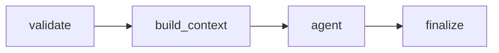

# Agent 5: Fraud Reasoning Agent (FRIA)

The **Fraud Reasoning Agent (FRIA)** evaluates transaction anomalies, suspicious patterns, spending deviations, and device/location risks. It runs as part of the processing pipeline to establish a fraud intelligence brief before downstream dispute categorization and workflow planning take place.

---

## ── Metadata & Configuration ──

* **Full Name**: Fraud Reasoning Agent (FRIA)
* **Code Registry**: [fraud_reasoning_agent](file:///d:/Transaction_dispute_agent/ai-dispute-resolution-system/backend/agents/fraud_reasoning_agent)
* **Domain**: BFSI (Banking, Financial Services, and Insurance)
* **Framework**: LangGraph (StateGraph)
* **LLM Engine**: ChatGroq (Llama-3.1-8B-Instant, Temperature 0)

---

## ── Agent Persona ──

* **Role**: Senior Fraud Analytics and Behavioral AI Expert.
* **Goal**: Perform transaction anomaly analysis, device/location risk checks, and spending pattern validation. Synthesize findings into a structured fraud risk JSON brief.
* **Backstory**: Developed to mitigate friendly fraud, social engineering scams, and account takeover (ATO) attacks. By evaluating historical ledger averages and geovelocity thresholds, FRIA produces precise probability scores and audit justifications.
* **Constraints**:
  - Never classify the dispute category (that is Agent 2's role).
  - Never suggest manual routing queues or analyst steps (that belongs to Agents 3 & 4).
  - Base all conclusions strictly on pre-computed tool records and database values.
  - Return ONLY valid, parseable JSON with no conversational prose.

---

## ── LangGraph Pipeline Flow ──

The agent's internal Graph topology executes as a linear pre-computed pipeline:



1. **`validate` Node**: Parses input dispute details, extracts and registers the Case ID.
2. **`build_context` Node**: Runs all lookup tools in parallel threads, gathers results, masks PII data, and structures the prompt payload.
3. **`agent` Node**: Invokes the ChatGroq model with the pre-assembled tool outputs for single-shot synthesis.
4. **`finalize` Node**: Parses the LLM's JSON output, stamps execution metrics, and applies deterministic server-side overrides/calibrations to ensure mathematical exactness.

---

## ── State Schema ──

The agent maintains state through `FraudReasoningAgentState` defined in [state.py](file:///d:/Transaction_dispute_agent/ai-dispute-resolution-system/backend/agents/fraud_reasoning_agent/state.py):

* `messages`: Annotated list accumulating chat history.
* `dispute_input`: Dictionary of raw case details.
* `case_id`: Assigned case identifier.
* `tool_results`: Dictionary caching output results from parallel tool execution.
* `final_output`: Synthesized JSON brief returned for database persistence.
* `error`: Optional string tracking failure reasons.
* `tools_used`: List tracking executed tool names.
* `agent_metadata`: Dictionary recording agent version, model, and invocation timestamps.
* `metrics`: Execution duration and token counters.

---

## ── Database-Backed Tools ──

All tools are located in [tools.py](file:///d:/Transaction_dispute_agent/ai-dispute-resolution-system/backend/agents/fraud_reasoning_agent/tools.py):

### 1. `detect_transaction_anomalies`
* **Purpose**: Analyzes transaction frequency, off-hours execution, and velocity spikes.
* **Inputs**:
  * `customer_id` (string)
  * `transaction_time` (string)
  * `transaction_date` (string)
* **Output**: Velocity breaches and off-hours flags.

### 2. `evaluate_location_velocity`
* **Purpose**: Scans historical transactions to check for geovelocity deviations (impossible travel distance between consecutive transactions).
* **Inputs**:
  * `customer_id` (string)
  * `location` (string)
  * `transaction_date` (string)
  * `transaction_time` (string)
* **Output**: Location consistency and geovelocity checks.

### 3. `analyze_spending_behavior`
* **Purpose**: Evaluates statistical behavioral deviations (amount standard deviation relative to customer's historical average).
* **Inputs**:
  * `customer_id` (string)
  * `amount` (float)
* **Output**: Spend outlier score and standard deviation reports.

---

## ── Synthesized Output Schema ──

The final output is a structured JSON brief mapping the following schema:

```json
{
  "case_id": "Unique case ID string",
  "fraud_probability": 0.85,
  "fraud_risk_level": "HIGH",
  "anomaly_detection": {
    "amount_anomaly": true,
    "time_anomaly": false,
    "velocity_anomaly": true
  },
  "device_location_risk": {
    "unrecognized_device": true,
    "location_mismatch": true
  },
  "spending_history_analysis": {
    "average_amount": 1250.0,
    "deviation_factor": 3.1
  },
  "fraud_reasoning": [
    "Transaction amount ₹5,000 exceeds 3x customer average spend.",
    "Unrecognized device ID transacted from atypical location.",
    "Dispute velocity breach flagged with multiple claims in 24 hours."
  ],
  "fraud_summary": "High risk of fraud indicated by significant spending deviation, unrecognized device fingerprint, and velocity breaches."
}
```

---

## ── Invocation ──

The agent is exposed via a standard entry point:
* **Function**: `run_fraud_reasoning_agent(dispute_input: dict, case_id: str) -> dict`
* **Module**: [__init__.py](file:///d:/Transaction_dispute_agent/ai-dispute-resolution-system/backend/agents/fraud_reasoning_agent/__init__.py)
* **Callers**: Called from `dispute_workflow.py` at the `fraud_reasoning` node, or from the ops re-analysis API endpoints in `ops_cases.py`.
